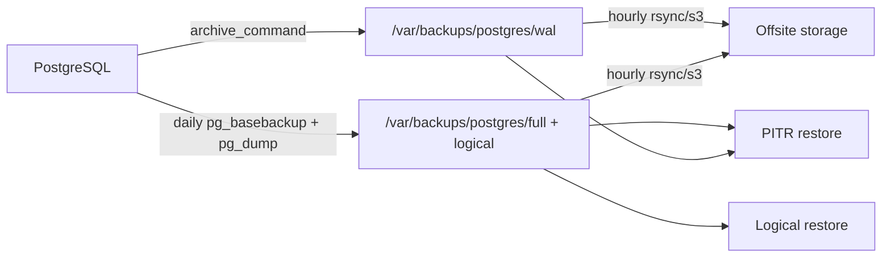

# PostgreSQL Backup & Recovery (VPS)

This runbook sets up **three layers of protection** for the Retail IMS ERP database:

| Layer | What it is | Frequency | Restore use |
|-------|------------|-----------|---------------|
| **Full (physical)** | `pg_basebackup` tarball | Daily ~02:15 UTC | Point-in-time recovery (PITR) base |
| **Full (logical)** | `pg_dump` custom format | Daily ~02:15 UTC | Fast full restore to a new database |
| **Transaction log (WAL)** | Archived WAL segments | Continuous (~60s) | Recover to exact minute before crash |

Scripts live in [`deploy/postgres/`](../deploy/postgres/).



## 1. One-time VPS setup (hosted PostgreSQL)

SSH into the VPS as root:

```bash
cd /opt/Inventory-control   # repo root on VPS (adjust to your checkout path)
sudo bash deploy/postgres/scripts/pg-install-backups.sh
```

Edit environment file:

```bash
sudo nano /etc/retail-ims/postgres-backup.env
```

Set at minimum:

- `PGDATABASE` — database name from your `DATABASE_URL`
- `PGUSER` / `PGPASSWORD` or a `~postgres/.pgpass` file
- Optional: `RSYNC_TARGET` or `S3_BUCKET` for offsite copies

Apply PostgreSQL archive settings:

```bash
# Find version
ls /etc/postgresql/

# Append snippet (review paths first)
sudo bash -c 'cat deploy/postgres/postgresql.conf.snippet >> /etc/postgresql/15/main/postgresql.conf'
sudo bash -c 'cat deploy/postgres/pg_hba.conf.snippet >> /etc/postgresql/15/main/pg_hba.conf'

sudo mkdir -p /var/backups/postgres/wal
sudo chown -R postgres:postgres /var/backups/postgres
sudo systemctl restart postgresql
```

Confirm WAL archiving works:

```bash
sudo -u postgres psql -c "SELECT name, setting FROM pg_settings WHERE name IN ('archive_mode','archive_command');"
sudo -u postgres psql -c "SELECT archived_count, failed_count FROM pg_stat_archiver;"
ls -lt /var/backups/postgres/wal | head
```

Run first backup manually:

```bash
sudo ENV_FILE=/etc/retail-ims/postgres-backup.env \
  /opt/retail-ims/postgres-backup/scripts/pg-full-backup.sh

sudo ENV_FILE=/etc/retail-ims/postgres-backup.env \
  /opt/retail-ims/postgres-backup/scripts/pg-verify-backup.sh
```

Enable scheduled jobs:

```bash
sudo systemctl start pg-full-backup.timer pg-wal-sync.timer pg-backup-prune.timer pg-backup-verify.timer
sudo systemctl status pg-full-backup.timer
```

## 1a. One-time setup (Docker PostgreSQL on the same VPS)

Use this when PostgreSQL runs in a container (e.g., `docker-postgres-1`).

```bash
cd /opt/Inventory-control
sudo bash deploy/postgres/scripts/pg-docker-install-backups.sh
sudo nano /etc/retail-ims/postgres-backup.env   # set DOCKER_CONTAINER, PGUSER/PGPASSWORD if needed
sudo systemctl start pg-docker-full-backup.timer pg-docker-company-backup.timer
sudo systemctl start pg-docker-prune.timer pg-docker-verify.timer
systemctl list-timers 'pg-docker-*'
```

Backups land on the host at:

```
/var/backups/postgres/full         # hourly full DB dumps (custom pg_dump format)
/var/backups/postgres/companies    # hourly per-company SQL dumps (filtered inserts)
/var/backups/postgres/logs         # backup.log
```

Retention: files older than **30 days** in `full/` and `companies/` are deleted by `pg-docker-prune.sh`.

## 2. Backup schedule (hosted default)

| Timer | Schedule | Script |
|-------|----------|--------|
| `pg-full-backup.timer` | Daily 02:15 UTC | Physical + logical full backup |
| `pg-wal-sync.timer` | Hourly | Copy WAL archive offsite (if configured) |
| `pg-backup-prune.timer` | Daily 03:30 UTC | Delete backups older than retention |
| `pg-backup-verify.timer` | Daily 04:00 UTC | Fail if latest backup missing/stale |

WAL segments are archived **continuously** by PostgreSQL (`archive_command`), not by cron. That is your real-time / 15-minute transaction log protection.

### Docker schedules

| Timer | Schedule | Script |
|-------|----------|--------|
| `pg-docker-full-backup.timer` | Hourly (randomized delay) | `pg-docker-full-backup.sh` |
| `pg-docker-company-backup.timer` | Hourly (randomized delay) | `pg-docker-company-backup.sh` |
| `pg-docker-prune.timer` | Daily 03:30 UTC | `pg-docker-prune.sh` |
| `pg-docker-verify.timer` | Daily 04:00 UTC | `pg-docker-verify-backup.sh` |

### Retention defaults

Configured in `/etc/retail-ims/postgres-backup.env`:

- Physical full backups: **14 days** local
- Logical dumps: **30 days** local
- WAL files: **14 days** local

**Important:** WAL retention must cover the age of your oldest base backup used for PITR. If you keep 14-day base backups, keep at least 14 days of WAL.

## 3. Offsite storage (strongly recommended)

Local VPS disk alone is **not** enough. If the VPS disk dies, you lose backups too.

### Option A — rsync to another server

```bash
# In postgres-backup.env
RSYNC_TARGET=backup@backup-server.example.com:/backups/retail-ims/postgres
```

Set up SSH key auth for root or a dedicated backup user.

### Option B — S3-compatible object storage

```bash
S3_BUCKET=s3://my-bucket/retail-ims/postgres
# Optional for MinIO/Wasabi:
# S3_ENDPOINT=https://s3.example.com
# AWS_PROFILE=retail-backup
```

Install AWS CLI on the VPS and configure credentials.

## 4. If the database crashes — recovery paths

### Path A: Quick full restore (most common)

Use when the database is corrupt or empty and you want the **latest daily snapshot**.

```bash
# Stop API first
pm2 stop retail-api

# Restore into a new database name for safety
sudo ENV_FILE=/etc/retail-ims/postgres-backup.env \
  /opt/retail-ims/postgres-backup/scripts/pg-restore-full.sh \
  /var/backups/postgres/logical/latest.dump retail_ims_restored

# Validate row counts, login, recent transactions
sudo -u postgres psql -d retail_ims_restored -c "SELECT count(*) FROM users;"

# Swap production DB (maintenance window)
sudo -u postgres psql -c "SELECT pg_terminate_backend(pid) FROM pg_stat_activity WHERE datname='retail_ims';"
sudo -u postgres dropdb retail_ims
sudo -u postgres psql -c "ALTER DATABASE retail_ims_restored RENAME TO retail_ims;"

pm2 restart retail-api
```

**Data loss:** anything after the last successful daily dump (up to ~24 hours unless you also PITR).

### Path B: Point-in-time recovery (PITR)

Use when you need to recover to **a specific time** (e.g. five minutes before bad DELETE).

```bash
pm2 stop retail-api

sudo ENV_FILE=/etc/retail-ims/postgres-backup.env \
  /opt/retail-ims/postgres-backup/scripts/pg-restore-pitr.sh \
  /var/backups/postgres/full/latest-base.tar.gz \
  '2026-05-26T10:25:00Z'

# Wait until recovery completes
sudo -u postgres psql -c "SELECT pg_is_in_recovery();"

pm2 restart retail-api
```

Requires:

1. A physical base backup (`full/latest-base.tar.gz`)
2. WAL files from base backup time through recovery target (`/var/backups/postgres/wal/` or offsite copy)

### Path A (Docker): Quick full restore

```bash
# Stop API first
pm2 stop retail-api

# Restore into a new database name
docker cp /var/backups/postgres/full/latest.dump docker-postgres-1:/tmp/restore.dump
docker exec -i docker-postgres-1 pg_restore -U retail -d retail_ims_restored /tmp/restore.dump

# Validate
docker exec -i docker-postgres-1 psql -U retail -d retail_ims_restored -c "SELECT count(*) FROM users;"

# Swap (maintenance window)
docker exec -i docker-postgres-1 psql -U retail -d postgres -c "SELECT pg_terminate_backend(pid) FROM pg_stat_activity WHERE datname='retail_ims';"
docker exec -i docker-postgres-1 psql -U retail -d postgres -c "DROP DATABASE retail_ims;"
docker exec -i docker-postgres-1 psql -U retail -d postgres -c "ALTER DATABASE retail_ims_restored RENAME TO retail_ims;"
pm2 restart retail-api
```

### Path B (Docker): Company-scoped restore (SQL subset)

Each company dump is a **filtered SQL file** (INSERT statements) under `/var/backups/postgres/companies/{code}/latest.dump`. To test/restore:

```bash
COMPANY_CODE=ACME       # folder name in companies/
docker cp /var/backups/postgres/companies/${COMPANY_CODE}/latest.dump docker-postgres-1:/tmp/company.sql
docker exec -i docker-postgres-1 psql -U retail -d retail_ims_restored -f /tmp/company.sql
```

These are **data-only** subsets (no schema). Use for audit or targeted re-seeding into a scratch database; they are not PITR or full-database backups.

### Path C: Catastrophic VPS loss

1. Provision new VPS
2. Install PostgreSQL (same major version if possible)
3. Restore WAL directory and latest base/logical backups **from offsite**
4. Follow Path A or Path B above

## 5. Monthly recovery drill (required)

Once per month on a staging machine:

1. Copy `latest.dump` and recent WAL directory
2. Run `pg-restore-full.sh` into a test database
3. Run one PITR test with a known `recovery_target_time`
4. Record duration and any errors in your ops log

If a drill fails, treat backup system as **non-functional** until fixed.

## 6. Monitoring & alerts

Check daily:

```bash
tail -50 /var/backups/postgres/logs/backup.log
sudo -u postgres psql -c "SELECT * FROM pg_stat_archiver;"
systemctl list-timers 'pg-*'
```

Set `ALERT_CMD` in `postgres-backup.env` to notify on failure (email, Slack webhook script, etc.).

Verification timer exits non-zero when:

- Latest backup older than 36 hours
- Checksum mismatch
- Missing `latest.dump` or `latest-base.tar.gz`

## 7. Cron alternative (if not using systemd)

```cron
15 2 * * * root ENV_FILE=/etc/retail-ims/postgres-backup.env /opt/retail-ims/postgres-backup/scripts/pg-full-backup.sh
0 * * * * root ENV_FILE=/etc/retail-ims/postgres-backup.env /opt/retail-ims/postgres-backup/scripts/pg-wal-sync.sh
30 3 * * * root ENV_FILE=/etc/retail-ims/postgres-backup.env /opt/retail-ims/postgres-backup/scripts/pg-prune-backups.sh
0 4 * * * root ENV_FILE=/etc/retail-ims/postgres-backup.env /opt/retail-ims/postgres-backup/scripts/pg-verify-backup.sh
```

## 8. FAQ

**Is this possible on my VPS?**  
Yes. PostgreSQL natively supports WAL archiving and physical backups. The scripts wrap standard tools (`pg_basebackup`, `pg_dump`, `archive_command`).

**Will I retain all data if the DB crashes?**  
- With **daily logical restore only**: you retain everything up to the last successful daily backup.  
- With **PITR (base + WAL)**: you can recover to any second covered by WAL retention, typically within minutes of the crash.  
- With **offsite copies**: you can survive full VPS loss.

**Does this replace VPS snapshots?**  
No. Use **both** — DB-aware backups for precise recovery, plus provider snapshots for whole-VM disaster recovery.

## Related docs

- [Deployment Safety Checklist](./deployment-safety-checklist.md)
- [Hardening Operations Runbook](./hardening-operations-runbook.md)

## In-app tenant backup (Pro/Plus)

Organisation admins can use **Settings → Backups** to:

1. Connect Google Drive (OAuth) or upload/download `.json.gz` tenant snapshots
2. Create on-demand company backups (queued job)
3. Dry-run restore, then apply restore with `RESTORE` confirmation

API endpoints live under `/api/v1/backups/*`. Artifacts are stored in `BACKUP_STORAGE_DIR` (default `./storage/backups`).

For uploaded tenant artifacts during VPS recovery:

```bash
sudo bash deploy/postgres/scripts/pg-restore-tenant-artifact.sh /path/to/tenant-backup.json.gz
```

Then either restore the database shell with `pg-restore-full.sh` or use in-app restore after the API is running again.
